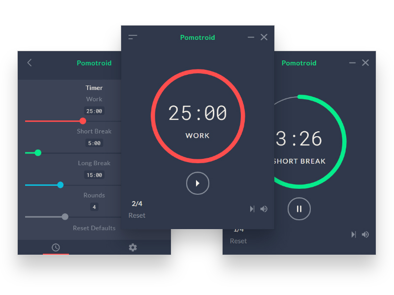

<div align="center">
  
</div>
<div align="center">
  
</div>

<p align="center">Simple and visually-pleasing Pomodoro timer.</p>

---

## Overview

Pomotroid is a simple and configurable Pomodoro timer. It aims to provide a visually-pleasing and reliable way to track productivity using the Pomodoro Technique.

Pomotroid is in its early stages, so feedback and contributions are welcome and appreciated! :seedling:

## Features

- Customize times and number of rounds (persistent)
- Charming timer alert sounds (optional)
- Desktop notifications (optional)
- Minimize to tray (optional)

## Roadmap

:memo: Future plans for enhancements and development:

- Mini-mode

## Download

Pomotroid is available for Windows 32/64, Mac OSX and Debian/Ubuntu flavored Linux.

Download the latest version from the [releases](https://github.com/Splode/pomotroid/releases) page.

You can also install Pomotroid on macOS with [Homebrew](https://brew.sh) by typing `brew cask install pomotroid` in a terminal window.

## Technical

Pomotroid is built with [Vue.js](https://github.com/vuejs/vue), [Electron](https://github.com/electron/electron), and [electron-vue](https://github.com/SimulatedGREG/electron-vue).

_Note: depending on your OS settings, you may receive a security warning upon installation. This has to do with Pomotroid being an unsigned application. You can find out more by researching code-signing for Apple and Microsoft._

### Build Setup

```bash
# install dependencies
npm i

# serve with hot reload at localhost:9080
npm run dev

# build Pomotroid for production
npm run build
```

## License

MIT &copy; [Christopher Murphy](https://github.com/Splode)
