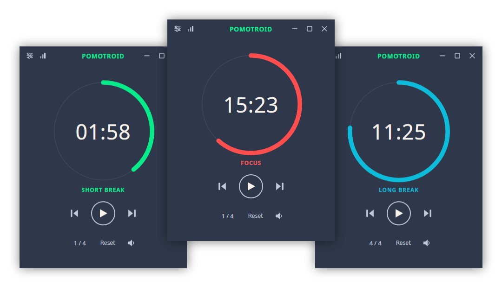
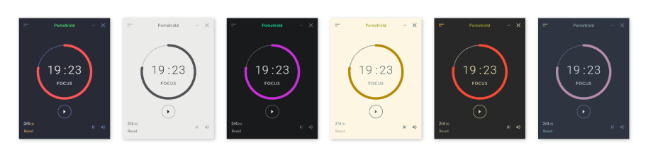

<div align="center">
  
</div>
<div align="center">
  
</div>

<p align="center">Simple and visually-pleasing Pomodoro timer.</p>

---

- [Overview](#overview)
- [Features](#features)
  - [Themes](#themes)
- [Install](#install)
  - [Download](#download)
  - [Homebrew](#homebrew)
  - [Scoop](#scoop)
  - [AppGet](#appget)
- [Roadmap](#roadmap)
- [Development](#development)
  - [Build Setup](#build-setup)
- [License](#license)

## Overview

Pomotroid is a simple and configurable Pomodoro timer. It aims to provide a visually-pleasing and reliable way to track productivity using the Pomodoro Technique.

Pomotroid is in its early stages, so feedback and contributions are welcome and appreciated! :seedling:

## Features

- Customize times and number of rounds (persistent)
- Charming timer alert sounds (optional)
- Desktop notifications (optional)
- Minimize to tray (optional)
- Several themes included with the ability to create custom themes.
- Timer activity logging.

### Themes

Pomotroid provides many themes. It's also theme-able, allowing you to customize its appearance.



Visit the [theme documentation](./docs/themes/themes.md) to view the full list of official themes and for instruction on creating your own.

## Install

### Download

Download the latest version from the [releases](https://github.com/Splode/pomotroid/releases) page.

Pomotroid is available for Windows, Mac OSX and Linux.

### Homebrew

You can also install Pomotroid on macOS with [Homebrew](https://brew.sh):

```sh
brew install --cask pomotroid
```

### Scoop

You can install Pomotroid on Windows with [scoop](https://scoop.sh/)

```sh
scoop install https://raw.githubusercontent.com/Splode/pomotroid/master/pomotroid.json
```

### AppGet

You can install Pomotroid on Windows with [AppGet](https://appget.net/)

```sh
appget install pomotroid
```

## Roadmap

:memo: Future plans for enhancements and development:

- Mini-mode

## Development

Pomotroid is built with [Vue.js](https://github.com/vuejs/vue), [Electron](https://github.com/electron/electron), and [electron-vue](https://github.com/SimulatedGREG/electron-vue).

_Note: depending on your OS settings, you may receive a security warning upon installation. This has to do with Pomotroid being an unsigned application. You can find out more by researching code-signing for Apple and Microsoft._

### Build Setup

```bash
# install dependencies
npm i

# serve with hot reload at localhost:9080
npm run dev

# build Pomotroid for production
npm run build
```

## License

MIT &copy; [Christopher Murphy](https://github.com/Splode)
