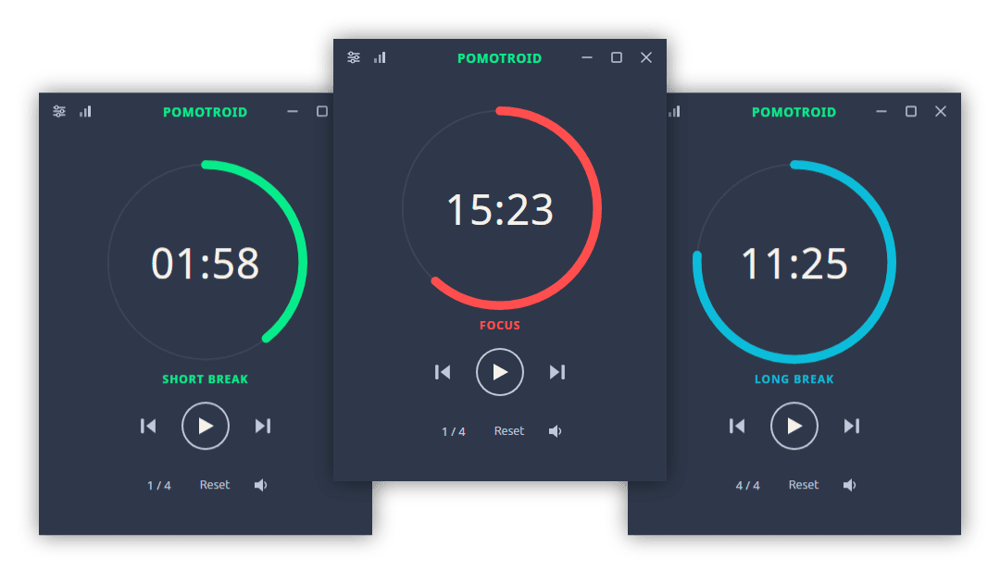
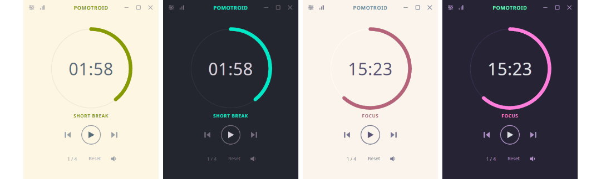

<div align="center">
  
</div>
<div align="center">
  
</div>

<p align="center">Simple and visually-pleasing Pomodoro timer.</p>

---

- [Overview](#overview)
- [Features](#features)
- [Statistics](#statistics)
- [Themes](#themes)
- [Install](#install)
- [WebSocket API](#websocket-api)
- [Development](#development)
- [License](#license)

## Overview

Pomotroid is a simple and configurable Pomodoro timer. It aims to provide a visually-pleasing and reliable way to track productivity using the Pomodoro Technique.

Built with [Tauri 2](https://tauri.app), [Rust](https://www.rust-lang.org), and [Svelte 5](https://svelte.dev).

## Features

- **Configurable timer** — customise work duration, break durations, and the number of rounds per long break
- **Statistics** — daily, weekly, and all-time session history with charts and a 52-week heatmap
- **38 bundled themes** — including Dracula, Nord, Tokyo Night, Catppuccin, Gruvbox, Rose Piné, and more; auto-switches with your OS light/dark preference
- **Custom themes** — drop a JSON file into the themes folder; applied instantly without a restart
- **Localization** — 8 languages: English, Spanish, French, German, Japanese, Chinese (Simplified), Turkish, and Portuguese; auto-detects OS language
- **Global shortcuts** — control the timer from anywhere, even when the window is hidden
- **Custom audio** — replace the built-in alert sounds with your own files
- **Tick sounds** — optional ticking during work and break rounds, independently toggleable
- **Dynamic tray icon** — progress arc updates in real time; reflects round type and pause state
- **Minimise / close to tray** — keep Pomotroid running in the background
- **Desktop notifications** — native OS alerts on round transitions
- **Compact mode** — a minimal set of controls appears when the window is resized small
- **Always on top** — optionally keep the timer above other windows
- **WebSocket server** — opt-in local server for stream overlays and external integrations
- **Diagnostic logging** — rotating log file with a one-click shortcut to the log folder

## Statistics

Pomotroid tracks every completed session and surfaces the data across three views: a daily summary with an hourly breakdown, a weekly bar chart with streak tracking, and an all-time 52-week heatmap.

<div align="center">
  
</div>

## Themes

Pomotroid ships with 38 themes and supports fully custom themes with live hot-reload.



See [THEMES.md](./THEMES.md) for the full theme list and instructions on creating your own.

## Install

### Download

Download the latest release from the [releases](https://github.com/Splode/pomotroid/releases) page.

Available for **Windows** (installer + standalone exe), **macOS** (universal DMG), and **Linux** (`.deb` + AppImage).

> **Note:** Pomotroid is currently unsigned. Depending on your OS security settings you may see a warning on first launch — this is expected and can be safely dismissed.

### Homebrew (macOS)

```sh
brew install --cask pomotroid
```

> The Homebrew cask is maintained separately and may lag behind the latest release. Check the [releases](https://github.com/Splode/pomotroid/releases) page for the most current version.

## Custom Themes

Pomotroid supports user-created themes with automatic hot-reload — no restart required. See [THEMES.md](./THEMES.md) for directory paths, the full color reference, and a step-by-step guide.

## WebSocket API

Pomotroid exposes an optional WebSocket server (disabled by default) for integration with external tools, stream overlays, and automation scripts.

**Enable it** in Settings → Advanced → WebSocket Server, then connect to `ws://127.0.0.1:<port>` (default port: 1314).

### Messages

**Client → Server**

| Message | Description |
|---|---|
| `{ "type": "getState" }` | Request the current timer state |

**Server → Client**

| Event | Payload | Description |
|---|---|---|
| `state` | `TimerState` object | Response to `getState` |
| `roundChange` | `TimerState` object | Fired whenever the timer advances to a new round |
| `error` | `{ message }` | Protocol error |

`TimerState` fields: `elapsed_secs`, `total_secs`, `is_running`, `is_paused`, `round_type`, `work_round_number`, `work_rounds_total`.

## Development

See [CONTRIBUTING.md](./CONTRIBUTING.md) for full setup instructions, project structure, and the release process.

### Quick start

```bash
# Install dependencies
npm install

# Run in development mode (hot-reload)
npm run tauri dev

# Build a production release
npm run tauri build
```

### Localization

UI strings live in `src/messages/<locale>.json` (en, es, fr, de, ja, zh, pt). The compiled output in `src/paraglide/` is generated at build time and is not committed to the repository.

**During development**, the Paraglide Vite plugin compiles messages automatically whenever `npm run tauri dev` or `npm run tauri build` is run — no manual step required.

**After adding or changing message keys**, regenerate the output explicitly so that `svelte-check` and your editor can pick up the new types:

```bash
npm run paraglide:compile
```

This is also run automatically as part of `npm run check`.

## License

MIT &copy; [Christopher Murphy](https://github.com/Splode)
