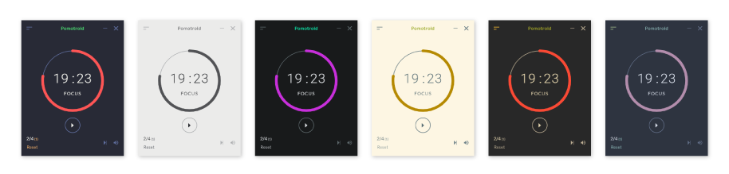

<div align="center">
  
</div>
<div align="center">
  
</div>

<p align="center">Simple and visually-pleasing Pomodoro timer.</p>

---

- [Overview](#overview)
- [Features](#features)
  - [Themes](#themes)
- [Install](#install)
  - [Download](#download)
  - [Homebrew](#homebrew)
  - [Scoop](#scoop)
  - [AppGet](#appget)
- [Roadmap](#roadmap)
- [Development](#development)
  - [Build Setup](#build-setup)
- [License](#license)

## Overview

Pomotroid is a simple and configurable Pomodoro timer. It aims to provide a visually-pleasing and reliable way to track productivity using the Pomodoro Technique.

Pomotroid is in its early stages, so feedback and contributions are welcome and appreciated! :seedling:

## Features

- Customize times and number of rounds (persistent)
- Charming timer alert sounds (optional)
- Desktop notifications (optional)
- Minimize to tray (optional)
- Several themes included with the ability to create custom themes.
- Timer activity logging.

### Themes

Pomotroid provides many themes. It's also theme-able, allowing you to customize its appearance.



See [THEMES.md](./THEMES.md) for the full theme list and instructions on creating your own.

## Install

### Download

Download the latest version from the [releases](https://github.com/Splode/pomotroid/releases) page.

Pomotroid is available for Windows, Mac OSX and Linux.

### Homebrew

You can also install Pomotroid on macOS with [Homebrew](https://brew.sh):

```sh
brew install --cask pomotroid
```

### Scoop

You can install Pomotroid on Windows with [scoop](https://scoop.sh/)

```sh
scoop install https://raw.githubusercontent.com/Splode/pomotroid/master/pomotroid.json
```

### AppGet

You can install Pomotroid on Windows with [AppGet](https://appget.net/)

```sh
appget install pomotroid
```

## Roadmap

:memo: Future plans for enhancements and development:

- Mini-mode

## Custom Themes

Pomotroid supports user-created themes with automatic hot-reload — no restart required. See [THEMES.md](./THEMES.md) for directory paths, the full color reference, and a step-by-step guide.

## WebSocket API

Pomotroid exposes an optional WebSocket server (disabled by default) for integration with external tools, stream overlays, and automation scripts.

**Enable it** in Settings → WebSocket Server, then connect to `ws://127.0.0.1:<port>` (default port: 1314).

### Messages

**Client → Server**

| Message | Description |
|---|---|
| `getState` | Request the current timer state |

**Server → Client**

| Event | Payload | Description |
|---|---|---|
| `state` | `TimerState` object | Response to `getState` |
| `roundChange` | `{ roundType, workRoundNumber, workRoundsTotal }` | Fired whenever the timer advances to a new round |
| `error` | `{ message }` | Protocol error |

`TimerState` object fields: `elapsed_secs`, `total_secs`, `is_running`, `is_paused`, `round_type`, `work_round_number`, `work_rounds_total`.

## Development

Pomotroid is built with [Tauri 2](https://tauri.app), [Rust](https://www.rust-lang.org), and [Svelte 5](https://svelte.dev).

_Note: depending on your OS settings you may receive a security warning upon installation because Pomotroid is currently unsigned. See PKG-02 in the project task list for code-signing status._

### Prerequisites

- [Rust](https://rustup.rs) (stable toolchain)
- [Node.js](https://nodejs.org) 18+
- Platform build dependencies — see the [Tauri prerequisites guide](https://tauri.app/start/prerequisites/)

### Build Setup

```bash
# Install Node dependencies
npm install

# Run in development mode (hot-reload)
npm run tauri dev

# Build a production release
npm run tauri build
```

The packaged output is written to `src-tauri/target/release/bundle/`.

### Localization

UI strings live in `messages/<locale>.json` (en, es, fr, de, ja). The compiled output in `src/paraglide/` is generated at build time and is not committed to the repository.

**During development**, the Paraglide Vite plugin compiles messages automatically whenever `npm run tauri dev` or `npm run tauri build` is run — no manual step required.

**After adding or changing message keys**, regenerate the output explicitly so that `svelte-check` and your editor can pick up the new types:

```bash
npm run paraglide:compile
```

This is also run automatically as part of `npm run check`.

## License

MIT &copy; [Christopher Murphy](https://github.com/Splode)
