# Pomotroid Themes

Pomotroid comes with many officially supported themes. You can also add any number of custom themes.

- [Pomotroid Themes](#pomotroid-themes)
  - [Available Themes](#available-themes)
  - [Creating a Custom Theme](#creating-a-custom-theme)

## Available Themes

These themes are available by default.

| Theme               | Main App                                                                | Timer Colors                                                            |
| ------------------- | ----------------------------------------------------------------------- | ----------------------------------------------------------------------- |
| Andromeda           | 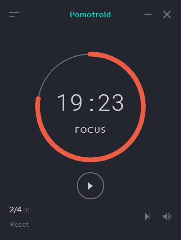                     |                      |
| Ayu Mirage          |                           | 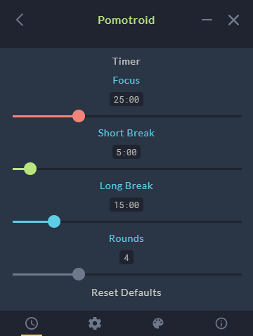                          |
| City Lights         | 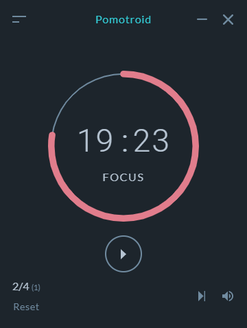                 | 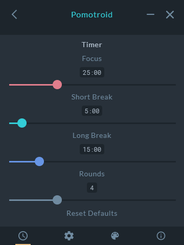                 |
| Dracula             | 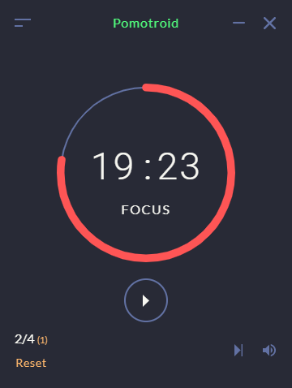                         | 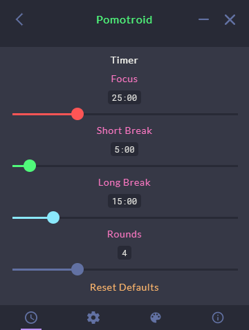                         |
| D.Va                | 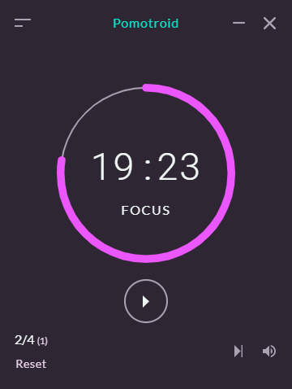                                | 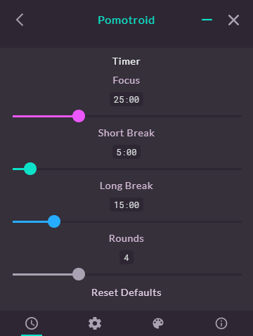                                |
| GitHub              | 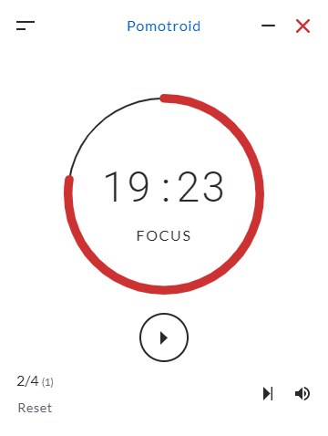                           | 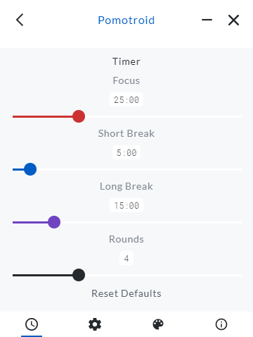                           |
| Graphite            | 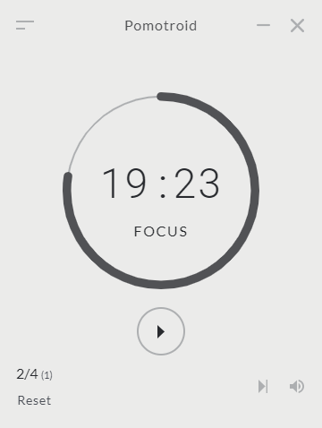                       | 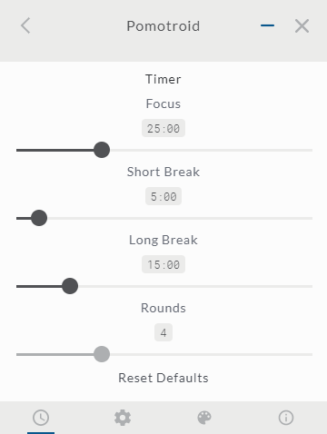                       |
| Gruvbox             | 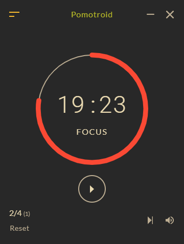                         | 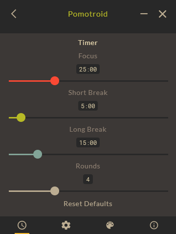                         |
| Monokai             | 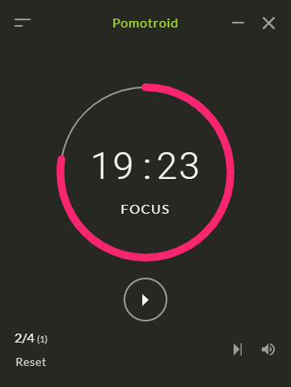                         | 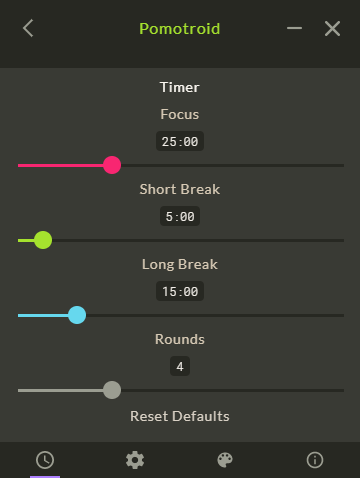                         |
| Nord                | 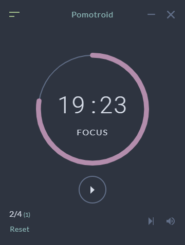                               | 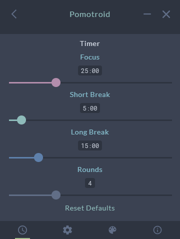                               |
| One Dark Pro        | 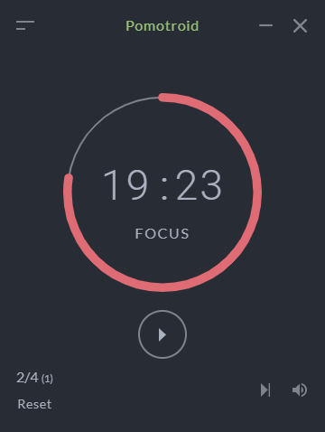               | 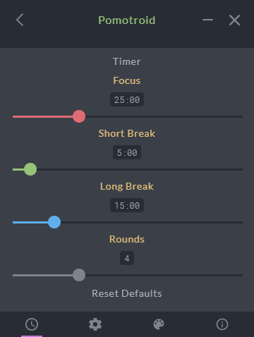               |
| Pomotroid (default) | 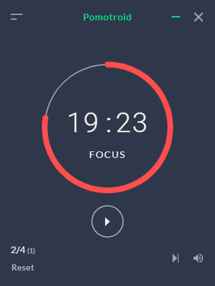                     |                      |
| Popping and Locking | 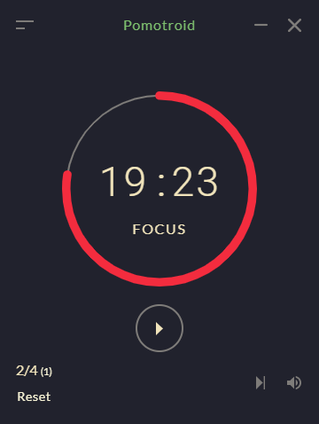 | 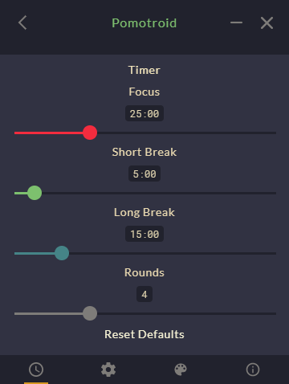 |
| Solarized Light     | 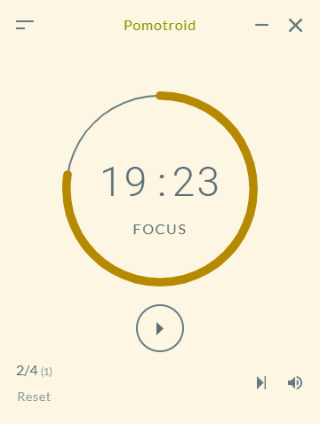         | 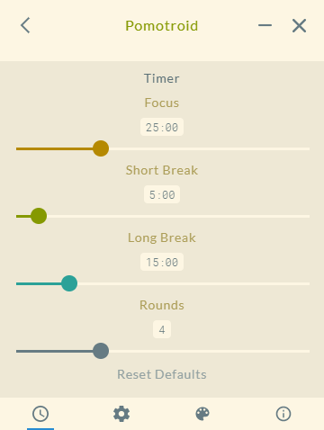         |
| Spandex             | 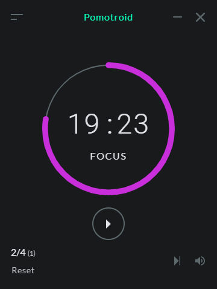                         | 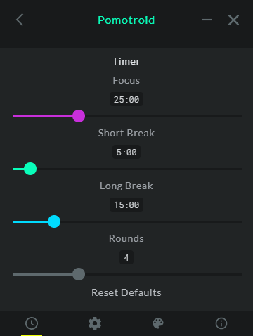                         |
| Sythwave            | 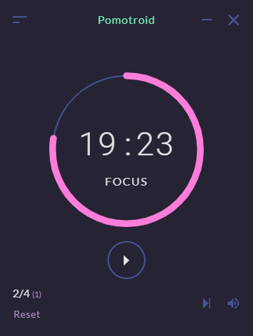                      | 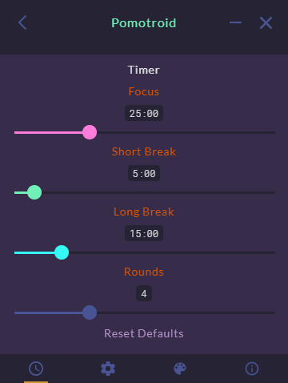                      |
| Tokyo Night Storm   | 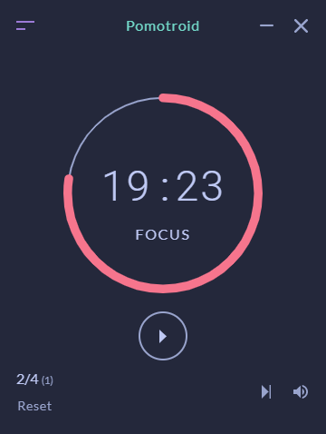     | 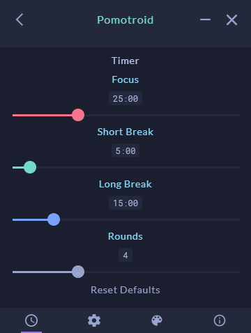     |

## Creating a Custom Theme

Creating custom themes is simple. Themes are defined by a `json` file containing a **theme name** and several color values. Use the [theme template file](./theme-template.json) as a starting point.

```json
// theme-template.json
{
  "name": "Theme Name",
  "colors": {
    "--color-long-round": "",
    "--color-short-round": "",
    "--color-focus-round": "",
    "--color-background": "",
    "--color-background-light": "",
    "--color-background-lightest": "",
    "--color-foreground": "",
    "--color-foreground-darker": "",
    "--color-foreground-darkest": "",
    "--color-accent": ""
  }
}
```

To add your custom theme, copy your theme definition to the `themes` directory in the `appData` directory. The location of the `appData` depends on the operating system.

- `%APPDATA%` on **Windows**
- `$XDG_CONFIG_HOME` or `~/.config` on **Linux**
- `~/Library/Application Support` on **macOS**

For example, add the theme file to the following directory on Windows: `C:\Users\{User}\AppData\Roaming\pomotroid\themes`

Restart the application to see your new theme available as an option.
